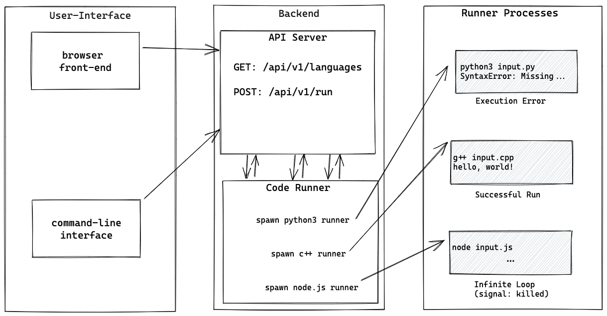

# 401X runner project

## Intro

The runner project is to create an interface for users to run their code remotely without having
to have any compiler on their machine. Websites like [LeetCode](https://leetcode.com/),
[AlgoExpert.io](https://www.algoexpert.io) and [CoderPad](https://app.coderpad.io/sandbox) let you write,
compile, run and view your code's output through your browser, no dependencies required. This project is to create a similar remote execution engine and server.


## Dev Environment

Editors:
- [Visual Studio Code](https://code.visualstudio.com/Download)
- [GoLand](https://www.jetbrains.com/go/) from Jetbrains for free with an [educational license](https://www.jetbrains.com/community/education/#students)

Extensions setup docs:

- Writing Go in VSCode: https://code.visualstudio.com/docs/languages/go
- Debugging Go in VSCode: https://github.com/golang/vscode-go/blob/master/docs/debugging.md
- Install for debugging: https://github.com/go-delve/delve
    ```
    go install github.com/go-delve/delve/cmd/dlv@latest
    ```

Recommended extensions (VSCode):

> Note: This will eventually be added to a `.vscode` folder in the repo to setup this automatically.

Search for these extension ids in VSCode and feel free to
add your personal favs:

- `golang.go`
   for running and debugging Go
- `ms-vscode-remote.remote-wsl`
   for Windows WSL users
- `yzhang.markdown-all-in-one`
   for writing docs
- `waderyan.gitblame`
   to figure out who wrote that bad code


Docker:

We will likely end up using Docker and include instructions here. For now, you
can install [Docker Desktop](https://www.docker.com/get-started) if you like.

### CLI Setup

CLI stands for command line interface.

#### Adding New Commands

Install cobra dependencies: (required to generate new commands)

```
go install github.com/spf13/cobra/cobra@v1.3.0
```

Add new cobra command

```shell script
# add new subcommand
cobra add <child command> -p <parent command>
cobra add childCommand -p 'parentCommand'
```

Add or adjust `~/.cobra.yaml` file for your name, license, year, etc. [Docs](https://github.com/spf13/cobra/blob/master/cobra/README.md)


### Go Tips

#### Working with Go Modules

Go Module:

```bash
# you usually will not have to run this since we should already have a go.mod and go.sum file
go mod init github.com/<name>/<repo-name>

# add new library
go get <new dependency>

# organize modules and dependencies
go mod tidy

# remove dependency
go mod edit -dropreplace github.com/go-chi/chi
```

### Documentation

When writing instructions for users and in the README, please follow syntax recommended by [google developer docs](https://developers.google.com/style/code-syntax)


### Other things

#### Change package name (just in case)

```shell script
# change module name in all files
 find . -type f \( -name '*.go' -o -name '*.mod' \) -exec sed -i -e "s;container-helper;ch;g" {} +
```

#### Releasing New Versions

> Note: This is mainly a reminder for me since
> I can't remember how on Earth to git tag stuff sometimes!


```shell
# releasing a new version
git tag -a v1.4 -m "Version notes here"
```

To delete tagging mistakes locally:

```shell
# delete local tag
git tag -d tagname
```

To delete remote tags:

```shell
# delete a tag already pushed to github
git push --delete origin tagname
```


### Concepts

- **Systems Design:** The service involves designing a 3+ part application to handle the user-interface, API server, and remote code runner.
- **Containers:** Each part of the service will be run in a container, at least for local testing. Container primitives like filesystem and namespace/process isolation will also be used to protect the host system from each process running the user's code.
- **Basic Multi-Tenant Design & Security:** Remote code can be extremely malicious. This project must handle a basic set of attacks for its first iteration.

### High Level Architecture Diagram

